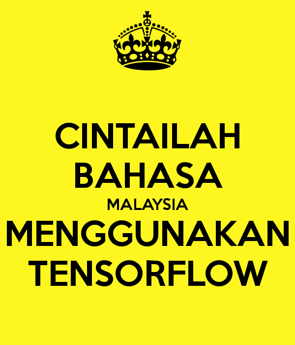

    

  

---

**Bahasa-NLP-Tensorflow**, Gathers Tensorflow deep learning models for Bahasa Malaysia NLP problems, **code simplify inside Jupyter Notebooks 100% including dataset**.

## Table of contents
  * [Speech to Text](https://github.com/huseinzol05/Bahasa-NLP-Tensorflow#speech-to-text)
  * [Optical Character Recognition](https://github.com/huseinzol05/Bahasa-NLP-Tensorflow#optical-character-recognition)

### [Optical Character Recognition](optical-character-recognition)

1. CNN + LSTM RNN

### [Speech to Text](speech-to-text)

1. BiRNN + LSTM + CTC Greedy
2. Wavenet
